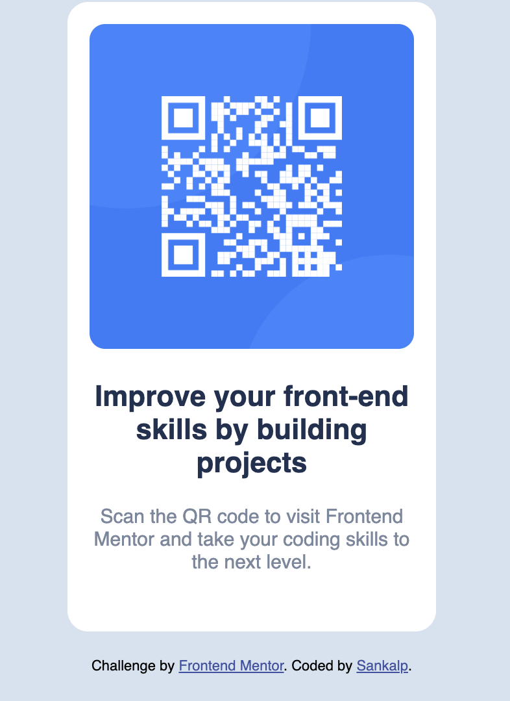

# Frontend Mentor - QR code component solution

This is a solution to the [QR code component challenge on Frontend Mentor](https://www.frontendmentor.io/challenges/qr-code-component-iux_sIO_H).

## Table of contents

- [Screenshot](#screenshot)
- [Links](#links)

- [Built with](#built-with)
- [Author](#author)

### Screenshot

### Links

- Solution URL: [Add solution URL here](https://your-solution-url.com)
- Live Site URL: [live site URL here](https://qr-code-frontendmentor-project.vercel.app/)

### Built with

- Semantic HTML5 markup
- CSS custom properties
- Flexbox
- Mobile-first workflow
- [Styled Components](https://styled-components.com/) - For styles

## Author

- Website - [Sankalp Sharma](https://sankalpsharma.vercel.app/)
- Frontend Mentor - [@sankalpsharmaofficial](https://www.frontendmentor.io/profile/sankalpsharmaofficial)
